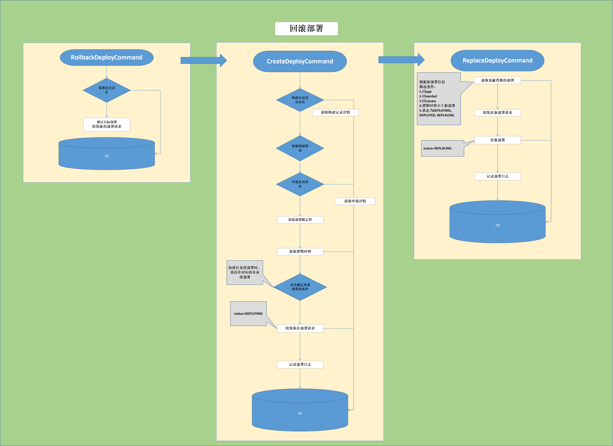

# Arthor

## 一、发布部署

### 1.1.概念

* Application，应用抽象，可基于Application进行业务扩展
* Feature，应用开发功能抽象，承载了对Feature生命周期的管理
* BuildRecord，构建记录，通过构建记录可进行多次部署
* Deployment，Kubernetes部署的抽象
* DeploymentRecord，部署记录
* Symbol，部署限定符，同一应用下不同部署的区分标识，目前稳定版本暂定为stable，
Arthor中部署相关操作都是基于Symbol进行的，
并且对于external部署而言，Symbol也参与了path的组成；
也可以通过Symbol实现指定服务访问，解决多分支开发；
* Canary，金丝雀特性，可实现蓝绿/灰度部署
* DeploymentName，部署名称，部署的唯一标识，ServiceName同理
* RouteName，Host+Symbol组成「不同部署模式略有区别」

### 1.2.Arthor发布部署使用流程

### 1.3.Arthor适配的应用架构

#### 1.NATIVE模式

#### 2.UNCOUPLED模式

    1.将服务治理与Kubernetes解耦，由API Gateway进行统一收口
      1.Kubernetes的精力集中在容器的编排部署上
      2.在发部部署时，也降低了复杂度
      3.提升了对部署的控制力度，缩短了在流量上的控制链路
    2.应用间通信方式
      1.基于Kubernetes网络直接通信
      2.基于网关反向代理
    3.支持NATIVE构架的平滑迁移

## 二、快速上手

#### 1.数据库配置
  
    1.创建数据库，名称为arthor
    2.导入数据库脚本arthor.sql
    3.插入用户信息,t_user
    INSERT INTO t_user VALUES (NULL, 'username', 'password', 'admin', NOW());
    4.插入环境信息,t_env
    INSERT INTO t_env VALUES (NULL, 'dev', '开发环境', '${dev环境host}');

#### 2.Jenkins配置
    
    1.jenkins.endpoint= #jenkins访问地址
    2.jenkins.username= #Jenkins用户名
    3.jenkins.apiToken= #Jenkins ApiToken
    4.jenkins.imageRepositoryOrg= #镜像仓库组织名称
    5.jenkins.imageRepositoryUsername= #镜像仓库用户名
    6.jenkins.imageRepositoryPassword= #镜像仓库密码
    7.jenkins.imageRepositoryHost= #镜像仓库地址
    8.根据项目结构,对config-template.xml进行项目结构的调整「complie与build image阶段」

#### 3.Nacos配置

    1.nacos.scheme= #Nacos协议
    2.nacos.host= #Nacos host
    3.nacos.port= #Nacos port

#### 4.Kubernetes配置

    1.kubernetes.debugging= #调试模式开关
    2.kubernetes.imagePullSecrets= #镜像拉取密钥
    3.kubernetes.defaultImagePullPolicy= #默认镜像拉取策略
    4.kubernetes.defaultPodPort= #默认Pod端口
    5.kubernetes.defaultServicePort= #默认Service端口
    6.kubernetes.gracePeriodSeconds= #优雅删除时间
    7.kubernetes.defaultPathType= #默认Ingress路径类型
    8.导入kubernetes集群的config文件，放入core中resources的kubernetes文件
#### 5.Apisix配置

    1.apisix.scheme= #Apisix协议
    2.apisix.host= #Apisix host
    3.apisix.port= #Apisix port
    4.apisix.authKey= #Apisix身份认证headerKey
    5.apisix.token= #Apisix身份认证headerValue

#### 6.部署模式配置

    1.command.deployMode= #部署模式,NATIVE|UNCOUPLED
    2.如需进行部署模式切换时，先清除t_deployment，t_deploy_record记录

#### 7.部署参数说明
    
    1.external：服务暴露标识
      true则会根据部署模式为对应服务创建路由
    2.symbol：部署限定符
      暴露服务时，构建服务请求地址，如user应用，symbol=stable，请求路径则为${host}:${port}/user.stable/${url}
      服务发现时，服务唯一标识，如user应用，symbol=stable，标识为user.stable

#### 8.运行服务
  
    1.arthor server模块，基于SpringBoot开发，直接run即可
    2.JDK 11+

## 三、总体设计

### 3.1.源码目录介绍

    1./doc : 文档资料
    2./script : Arthor数据库DDL
    3./server : Console后台服务
    4./core :「核心模块」包含流程，命令，状态，插件等，可基于core模块自定义发布部署的流程
    5./arthor-plugin-boot-starter :「插件模块」使Java Application具备与Arthor交互的能力，快速接入Arthor流程
    6./arthor-core-boot-starter : 「核心模块Starter」基于SpringBoot AutoConfigure特性实现核心模块的可插拔配置

### 3.2.Arthor数据库说明

    1.t_application: 应用表,维护应用信息
    2.t_feature: 功能表,维护应用开发功能的生命周期
    3.t_pipeline: 流水线表,维护流水线信息
    4.t_env: 环境表,维护不同环境数据
    5.t_build_record: 构建记录表,记录不同Feature在流水线中的构建记录,如构建BuildNumber,Docker镜像id,环境等
    6.t_counter: 逻辑时钟计数器表,利用ID自增实现
    7.t_lock: 锁表,利用unique索引实现    
    8.t_deploy_record: 部署记录表,维护部署的操作记录
    9.t_deployment: 部署表,对部署的整体抽象,包含Kubernetes中Deployment,Service,Ingress以及Api Gateway等
    10.t_user: 用户表

### 3.3.架构设计

#### 3.3.1.设计思想

  * 通过「状态机」定义了发布部署流程
    
  * 将部署中的资源进行最大程度的隔离，实现「最自由的」部署流程
  * 通过命令模式将部署操作与执行逻辑进行收敛，为用户自定义部署流程提供基础
  * 通过SPI，便于组件替换，提升扩展性

#### 3.3.2.系统模块

  * core模块，包含流程，命令，状态，插件等，可基于core模块自定义发布部署的流程
  * server模块，Arthor自带的Console管理后台
  * plugin模块，Java Application接入Arthor的插件包

#### 3.3.3.架构图
  
  
  
    1.Console：提供交互
    2.数据支撑：提供数据查询持久化方式
    3.执行层：承接数据层提供的数据，通过数据流转流程，调用第三方服务
    4.第三方服务：集成的具体第三方服务
### 3.4.实现细节

#### 3.4.1.应用创建流程

  
    
    1.流水线与应用是一一绑定的，流水线不会区分构建的环境
    2.流水线构建时，需指定构建参数代码仓库，分支，环境，即对功能进行构建
#### 3.4.2.功能创建流程

  

    1.功能作为发布部署的最小单位，需指定代码仓库，分支，环境
#### 3.4.3.流水线创建
流水线的创建关键在于「流水线Configuration」以及「流水线Script」的配置

Arthor将读取到的模板内容「config-template.xml」，结合应用特定信息，完成流水线的配置。
* 流水线Configuration

      设置了三个构建参数，分别如下：
      1.repository_url，代码仓库地址，便于流水线进行代码更新
      2.branch，代码仓库分支名称
      3.environment，构建环境，配合不同环境的Dockerfile进行镜像的build
* 流水线Script
          
      流水线Script被分成三个stages，分别如下：
      1：stage('clone repo')，拉取最新代码，获取commitId，并设置构建Description
      2：stage('complie')，切换至对应工作目录进行mvn package
      3：stage('build image')，镜像构建，推送至镜像仓库
* [config-template.xml示例](files/config-template.xml)
* [流水线Script示例](files/script-example.script)

#### 3.4.4.流水线构建

* 3.4.4.1.流水线构建流程

* 3.4.4.2.NextBuildNumber获取说明
  
      1.获取构建号是为了后续对Jenkins的构建结果进行查询
      2.为了保证构建记录与Jenkins一一对应,故在获取构建号以及构建记录落库期间进行了环境，应用维度的排他处理

* 3.4.4.3.CommitId获取说明

      1.获取CommitId的方式,大致分为两种
        1.对构建进行排他处理，保证同一流水线仅存在一个构建操作，基于该前提则可在构建时，获取到代码仓库的CommitId
        2.支持同一流水线的多次构建，以流水线的构建历史为准
      2.由于Arthor将构建与部署进行拆分，故选择第二种获取的方式，即在流水线构建时，借助流水线的Description进行CommitId的传递
      
#### 3.4.5.发布部署

* 3.4.5.1.发布部署流程图

  

      1.部署相关操作：AbtractDeployCommand根据不同的操作以及内部流程，组装数据并且落库
      2.执行相关操作：AbtractExecuteCommand根据不同的数据类型，对第三方服务执行操作以及操作结果验证
* 3.4.5.2.发布部署功能清单

  | 操作 | 说明 | 场景 |     
  |-------|------|------|
  | 替换部署 | 基于构建记录，通过Kubernetes SDK实现部署 | 1.快速部署及部署替换「非生产环境」  2.指定不同Symbol以实现多Feature部署
  | 灰度部署 | 将该部署标识为灰度 1.外部服务可基于header访问到该部署 2.内部服务可在服务发现时进行识别 | 1.线上验证  2.新特性测试 
  | 蓝绿部署 | 按照权重将流量分别路由到不同部署 | 需要流量进行验证的场景
  | 蓝绿调整 | 调整蓝绿部署的权重比例 | 流量调整
  | 部署提升 | 针对灰度及蓝绿部署来说，将其更新为稳定部署stable | 灰度/蓝绿部署需提升为稳定部署
  | 部署回滚 | 根据历史部署记录，进行部署 | 部署的快速回退
  | 部署下线 | 部署下线 | 下线并清理部署资源，生产慎用
  | 扩缩容 | 对部署的副本数进行变更 | 1.部署的扩缩容 2.部署重启，副本数不变

* 3.4.5.3.替换/灰度/蓝绿部署
  
  
  
      1.CreateDeployCommand：
        1.作用：数据组装，创建新的部署信息
        2.获取逻辑时钟，作为替换部署的查询条件
        3.部署canary时，需校验相同symbol是否存在非canary部署，这是由于路由通过Nginx实现，当canary部署单独存在时路由不会生效
      2.ReplaceDeployCommand：
        1.作用：筛选待替换的部署，并且更新其状态
        2.筛选DEPLOYED，DEPLOYING，REPLACING状态通过最终一致性来确定替换关系
    
* 3.4.5.4.蓝绿调整部署

  

      1.UpdateBlueGreenDeployCommand：
        1.更新部署信息：canaryValue，lifecycle，routeStatus，status
* 3.4.5.5.提升部署

  

      1.PromoteDeployCommand：
        1.提供提升的校验流程
        2.为后续部署组装所需数据
* 3.4.5.6.部署回滚

  

      1.RollbackDeployCommand：
        1.提供回滚的校验流程
        2.为后续部署组装所需数据  
* 3.4.5.7.下线部署

  

      1.DeleteDeployCommand：
        1.提供下线的校验流程
        2.更新下线部署的状态
* 3.4.5.8.扩缩容部署

  

      1.ScaleDeployCommand：
        1.提供扩缩容的校验流程
        2.为后续部署组装所需数据
* 3.4.5.9.部署分发

  
  
      1.将上述创建的部署信息按照状态进行拉取
      2.并对部署信息按照应用，环境，symbol进行分组，获取部署列表
      3.将部署列表按照tick排序，确定最终以及瞬时状态的部署信息
      4.对于最终状态则进行部署，瞬时则进行删除操作「释放资源」

* 3.4.5.10.执行部署

  
      
      1.主流程的判断控制：具体实现详见AbstractDeployExecuteCommand
      2.获取Deployment详情：通过Kubernetes SDK获取指定namespace中，指定name的Deployment信息
      3.创建Deployment：通过Kubernetes SDK创建指定namespace，name，replicas，imageId，podLabel的Deployment
      4.校验Deployment副本数：通过对比部署中的副本数是否与Kubernetes中Deployment的UpdatedReplicas相等
      5.处理元数据：以Pod的Ip，Port，ServiceName作为唯一标识，将部署信息设置到Nacos，为其他服务在负载均衡时提供筛选依据「Lifecycle，Canary，Symbol」
      6.获取Service详情：通过Kubernetes SDK获取指定namespace中，指定name的Service信息
      7.创建Service：通过Kubernetes SDK创建指定namespace，name，matchLabelSelector，targetPort的Service
      8.获取Route详情：「NATIVE模式」通过Kubernetes SDK获取指定namespace中，指定name的Ingress信息
      9.创建Route：「NATIVE模式」通过Kubernetes SDK创建指定namespace，name，host，path，service，canary的Ingress
      10.修改Route：「NATIVE模式」通过Kubernetes SDK修改指定namespace，name的Ingress中的path，service，canary属性
      11.「NATIVE模式」Route由Ingress实现：Ingress允许Canary部署单独创建，故Canary的Ingress与非Canary的Ingress是分开的
      12.「UNCOUPLED模式」Route由Apisix实现：Apisix仅允许一个Host与Path仅出现一个Route，故Canary与非Canary的Route都是放在一起的，只不过Canary交由traffic-split插件实现

* 3.4.5.11.删除部署

  

      1.主流程的判断控制：具体实现详见AbstractDeleteExecuteCommand
      2.关联部署：关联部署能使部署删除时「手动下线除外」，切换更为平滑
      3.删除Route：「NATIVE模式」通过Kubernetes SDK删除指定namespace，name的Ingress
      4.删除Service：「NATIVE模式」通过Kubernetes SDK删除指定namespace，name的Service
      5.删除Deployment：「NATIVE模式」通过Kubernetes SDK删除指定namespace，name的Deployment

#### 3.4.6.逻辑时钟

  * 设计初衷
    
        1.对于同一应用，同环境，同symbol的外部部署来说，Route属于共享资源，多部署操作难免会出现竞争的情况
        2.常见的手段:
          1.加锁：限制同时仅有一个部署进行操作，但由于Route存在生效期，故需要延长锁的持有时长
          2.最终一致性「采纳」：通过逻辑时钟的方式将各种对Route的操作进行排序，选择出最终的Route状态，从而进行部署
          但是普通的最终一致性会导致切换不平滑的情况出现，Arthor在最终一致性上提前做出逻辑判断，避免逻辑上出现最终不一致性的情况         
  * 逻辑时钟自增清单
    
  
#### 3.5.如何平滑切换与优雅关机

* 资源独立

      1.不同的部署，采用独立的资源
      2.不依靠Deployment的rollout机制，通过部署独立的方式实现切换
      3.依靠Nginx Reload机制，实现路由的更新
      
  * Nginx Reload
    
* 平滑的切换流程

      1.部署时，先保证Deployment成功部署，再保证元数据Lifecycle更新成功，最后操作Route相关
      2.下线时，先断开入口流量，无论是外部还是内部的服务发现，
      再更新元数据Lifecycle，并通过缓冲时间尽量保证Pod内部剩余任务执行完毕以及服务发现及时更新，最后处理Deployment
* 流量细节
    * 外部流量
      现有操作中，排除无用路由的删除以及新增路由外，
      其余操作都是对Nginx进行Patch操作，其利用了Nginx Reload机制，对客户端是毫无感知的，
      况且更新nginx为最后一步，更新成功后请求便能打到可用Pod上
      
      * 注意
        * 在keep-alive下，如server断开连接，client在未收到FIN时，继续请求则会出现异常「如下通过Jmeter测试提升时」
          keepalive_timeout，默认75s
          

          * 解决方案
            * 禁用keep-alive
            * 客户端将keep-alive时间，调整至小于nginx

        * reload时，old worker优雅关机时间
          * worker_shutdown_timeout，默认240s

    * 服务发现

      * 当Pod被成功创建时，虽能在注册中心进行注册，
        但由于其lifecycle仍为creating，
        在服务的负载均衡时可被过滤
      * 当Pod即将被销毁时，首先会断开起外部流量入口，
        变更lifecycle状态，并且在强制销毁前，留有缓冲时间「最好大于服务发现自动刷新的间隔时间*2」

## 四、版本更新日志

### 1.版本v1.0-beta「2023-03-08」

#### 1.beta版本，Arthor框架初步搭建完成

## 五、TODO LIST

#### 1.实现中间件隔离，如DB，NoSQL，MQ，Job等
#### 2.集成日志
#### 3.链路追踪
#### 4.SLI指标告警监控
#### 5.配置中心
#### 6.集成代码仓库
#### 7.集成Jira
#### 8.集成Confluence

